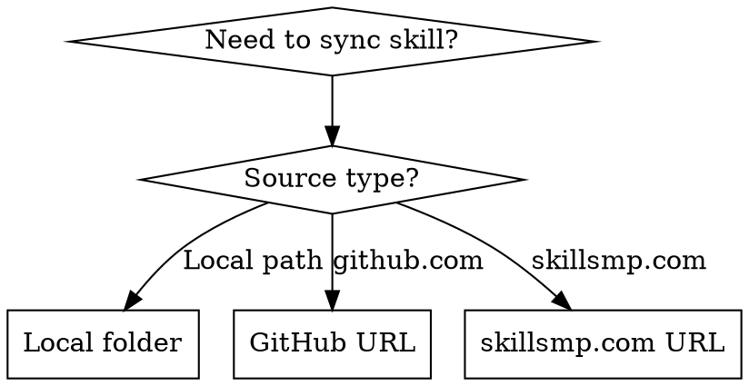

# Sync Skills

## Overview
Automatically sync skills from multiple sources to all installed AI coding tool directories. Lists all existing target directories for user confirmation before syncing.

## When to Use



Use when:
- User provides local skill folder path
- User provides GitHub repository URL
- User provides skillsmp.com skill detail page URL
- Need to distribute skill across multiple AI tools

**How it works:**
1. Auto-detect source type from input
2. Prepare skill content based on source
3. Check all target directories (only existing ones)
4. **List existing targets for user confirmation**
5. Copy/clone to each confirmed target

## Target Directories

Checks these paths in order, only syncs if directory exists:

| Tool | Project Level | User Level |
|------|---------------|------------|
| Claude Code | `.claude/skills` | `~/.claude/skills` |
| GitHub Copilot | `.github/skills` | `~/.copilot/skills` |
| Google Antigravity | `.agent/skills` | `~/.gemini/antigravity/skills` |
| Cursor | `.cursor/skills` | `~/.cursor/skills` |
| OpenCode | `.opencode/skill` | `~/.config/opencode/skill` |
| OpenAI Codex | `.codex/skills` | `~/.codex/skills` |
| Gemini CLI | `.gemini/skills` | `~/.gemini/skills` |
| Windsurf | `.windsurf/skills` | `~/.codeium/windsurf/skills` |
| Qwen Code | `.qwen/skills` | `~/.qwen/skills` |
| Qoder | `.qoder/skills` | `~/.qoder/skills` |

## Quick Reference

**Basic Usage:**
```bash
./sync-skill.sh <source>
```

**Examples:**
```bash
# Local folder
./sync-skill.sh /Users/user/skills/my-skill

# GitHub repository
./sync-skill.sh https://github.com/user/skill-repo

# skillsmp.com page
./sync-skill.sh https://skillsmp.com/skills/skill-name
```

### Source Type Detection

```bash
# Local folder
/Users/user/skills/my-skill
./skills/my-skill
~/skills/my-skill

# GitHub URL
https://github.com/user/skill-repo
https://github.com/user/skill-repo.git
git@github.com:user/skill-repo.git

# skillsmp.com URL
https://skillsmp.com/skills/skill-name
https://www.skillsmp.com/skills/skill-name
```

### Sync Commands by Source Type

**Local folder:**
```bash
cp -r /path/to/skill-name ~/.claude/skills/
cp -r /path/to/skill-name ~/.qoder/skills/
# ... for each existing target
```

**GitHub:**
```bash
# Clone to temp
git clone https://github.com/user/skill-repo.git /tmp/skill-sync

# Copy skill folder (might be in subdirectory)
cp -r /tmp/skill-sync/skill-name ~/.claude/skills/
# ... for each existing target

# Cleanup
rm -rf /tmp/skill-sync
```

**skillsmp.com:**
```bash
# Fetch page content
curl -s https://skillsmp.com/skills/skill-name > /tmp/skill-page.html

# Parse and download skill files
# Extract skill content from page
# Create skill directory structure
# Copy to each target
```

## Implementation

**Executable script:** See `sync-skill.sh` in this skill directory.

**Features:**
- Auto-detects source type (local, GitHub, skillsmp.com)
- Checks all target directories for existence
- **Lists existing targets and waits for user confirmation before syncing**
- Only syncs to user-confirmed directories
- Overwrites existing skills without prompting
- Cleans up temporary files after use
- Provides clear output with emoji indicators

**Exit codes:**
- 0: Success
- 1: Error (missing source, clone failure, etc.)

**Using from AI assistant:**
When user asks to sync a skill, invoke the script with appropriate source:

```bash
# User says: "Sync the skill at /path/to/my-skill"
./sync-skill.sh /path/to/my-skill

# User says: "Sync this GitHub repo: https://github.com/user/skill"
./sync-skill.sh https://github.com/user/skill
```

### Source Detection

```javascript
function detectSource(input) {
  // Local folder
  if (input.startsWith('/') || input.startsWith('./') || input.startsWith('~')) {
    return { type: 'local', path: input };
  }

  // GitHub URL
  if (input.includes('github.com')) {
    const url = input.replace(/\.git$/, '');
    return { type: 'github', url };
  }

  // skillsmp.com URL
  if (input.includes('skillsmp.com')) {
    return { type: 'skillsmp', url: input };
  }

  throw new Error(`Unknown source type: ${input}`);
}
```

### Directory Existence Check and Confirmation

```bash
# Check if directory exists and collect for confirmation
check_and_sync() {
  local source=$1
  local skill_name=$2

  # Array of all target directories
  local targets=(
    "$HOME/.claude/skills"
    "$HOME/.qoder/skills"
    "$HOME/.copilot/skills"
    # ... all others
  )

  local existing_targets=()

  # First pass: collect existing directories
  for target in "${targets[@]}"; do
    if [ -d "$target" ]; then
      existing_targets+=("$target")
    fi
  done

  # List existing targets and ask for confirmation
  if [ ${#existing_targets[@]} -eq 0 ]; then
    echo "❌ No target directories found. Please install at least one AI coding tool."
    exit 1
  fi

  echo "📋 Found ${#existing_targets[@]} existing target directory(s):"
  echo ""
  for i in "${!existing_targets[@]}"; do
    echo "  $((i+1)). ${existing_targets[$i]}"
  done
  echo ""
  read -p "✅ Sync to these directories? (y/N): " confirm

  if [[ ! "$confirm" =~ ^[Yy]$ ]]; then
    echo "❌ Sync cancelled by user."
    exit 1
  fi

  echo ""
  echo "🚀 Starting sync..."

  # Second pass: sync to confirmed targets
  for target in "${existing_targets[@]}"; do
    echo "  → Syncing to $target..."
    # Perform sync
  done
}
```

### GitHub Repository Handling

```bash
# Clone to temp directory
git clone https://github.com/user/repo.git /tmp/skill-sync-XXXXX

# Find skill folder (might be root or subdirectory)
if [ -f /tmp/skill-sync-XXXXX/SKILL.md ]; then
  skill_folder="/tmp/skill-sync-XXXXX"
elif [ -d /tmp/skill-sync-XXXXx/skills/* ]; then
  skill_folder="/tmp/skill-sync-XXXXx/skills/*"
fi

# Copy to each existing target
for target in "${existing_targets[@]}"; do
  cp -r "$skill_folder" "$target/"
done

# Cleanup
rm -rf /tmp/skill-sync-XXXXX
```

### skillsmp.com Page Handling

```bash
# Fetch page
url="https://skillsmp.com/skills/skill-name"
curl -s "$url" > /tmp/skill-page.html

# Extract skill name and files
skill_name=$(grep -o '<h1[^>]*>.*</h1>' /tmp/skill-page.html | sed 's/<[^>]*>//g')

# Download or extract skill content
# This depends on skillsmp.com's structure
# Might need to parse JSON, download files, etc.

# Create skill directory
mkdir -p "/tmp/$skill_name"

# Save content to SKILL.md
# ... parsing logic ...

# Sync to targets
for target in "${existing_targets[@]}"; do
  cp -r "/tmp/$skill_name" "$target/"
done
```

## Common Mistakes

| Mistake | Fix |
|---------|-----|
| Syncing without user confirmation | Always list targets and wait for `y/N` confirmation |
| Syncing to non-existent directories | Always check `-d` before copying |
| Leaving temp files | Always cleanup `/tmp/skill-sync-*` after use |
| GitHub subdirectory confusion | Check for SKILL.md in root and subdirectories |
| Not handling .git suffix | Strip `.git` from URLs before cloning |
| skillsmp.com parsing failures | Inspect page structure first, adapt parsing |
| Forgetting to show skill name | Always display skill name in confirmation prompt |

## Conflict Handling

**Policy: Always overwrite existing skills**

If a skill with the same name exists in a target directory:
- Overwrite without prompting
- Log what was overwritten: `"Overwriting existing skill at $target/$skill_name"`
- No backup (user should use git if they need history)

**Rationale:** Sync operations are expected to update content. If user wants to preserve local changes, they should manage version control separately.
